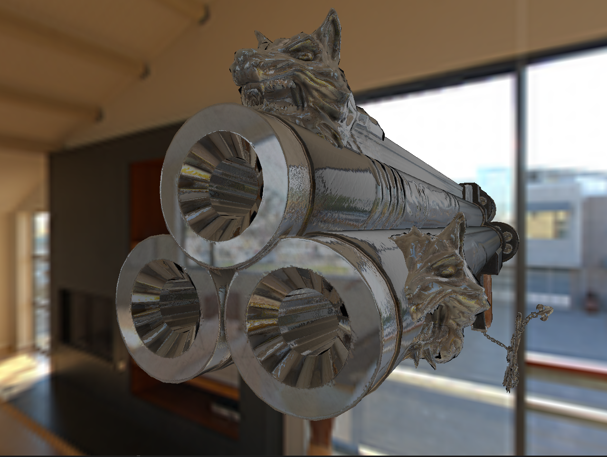

# Personal OpenGL Graphics Renderer

An OpenGL graphics renderer largely based on Joey de Vries' [Learn OpenGL tutorial](https://learnopengl.com/) and Jasper Flick's [Catlike Coding tutorials](https://catlikecoding.com/). The project serves as functioning render engine to teach myself graphics techniques.

## Samples

## Features
Renderer
- Material/shader pipeline
    - Custom shader pre-processor to handle defines and includes
    - Normal mapping
    - Metal, Smoothness, Occlusion, and Emission mapping
- Physically based rendering
    - Diffuse integral, prefiltered environments, and BRDFlut
    - Multiple directional/point light
    - Shadow mapping for both
    - Cascading shadow maps for directional lights
    - Image based lighting
- Post-procesing
    - Gamma Correction

Other
- Scene management
    - Scene objects with position, rotation, and scale
    - Easy to add using pre-defined meshes (cube, sphere, etc) and materials
    - Object hierarchy structure allows transforms to be relative to one-another
- Logging utility using the [spdlog library](https://github.com/gabime/spdlog)
- Editor using [ImGui library](https://github.com/ocornut/imgui)
    - Edit materials and object transforms during runtime
- Object loading using the [tinyobjloader library](https://github.com/tinyobjloader/tinyobjloader)
    - Maunally calculates tangents 

## Building on Windows
1. Clone repo
2. Download [GLFW pre-compiled binaries](https://www.glfw.org/download) and put the `libglfw3.a` file in `src/libs/glfw/`. 
3. Compile with CMake and then run

## Limitations
- Has only been tested on my own system running on Windows with the MingW64 compiler